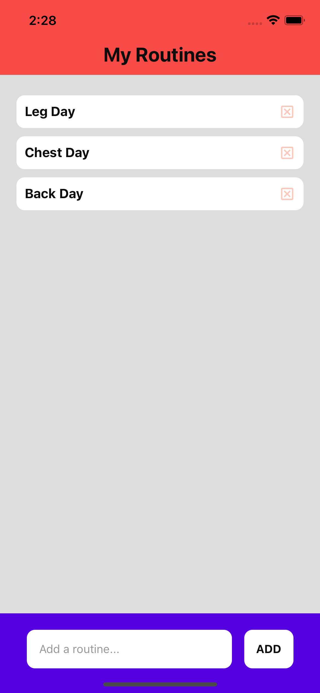
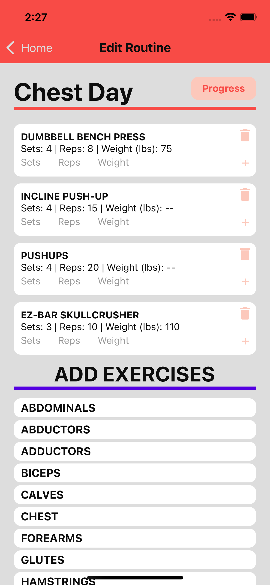
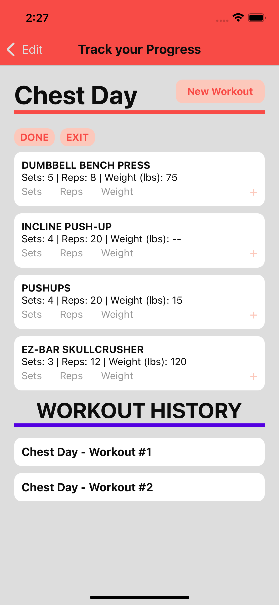

# GainsTracker

React Native app for fitness and tracking gym progress. The user can create and customize workout routines with a long list of exercises and log results to view their personal progress.

  
   
  

This project was created using the default template provided by `npx create-react-native-app`

## How to run

1. `git clone https://github.com/tfitzpatrick0/GainsTracker.git`
2. `cd GainsTracker`
3. `npm i`
4. `npm run start`
5. Enter `i` or `a` in the EXPO terminal to open the app in either iOS or Android simulator, or scan the QR code to open the app on your personal device.

Requirements:

- Node.js (developed with v18.1.0)
- To simulate on Android - [Setup Android Simulator](https://docs.expo.dev/workflow/android-studio-emulator/)
- To simulate on iOS - [Setup iOS Simulator](https://docs.expo.dev/workflow/ios-simulator/)

If you try to open EXPO Browser DevTools (localhost:19002) and it's not displaying:

- `npx uri-scheme add gains-tracker`
